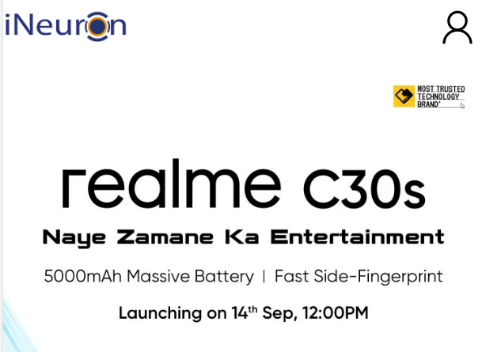
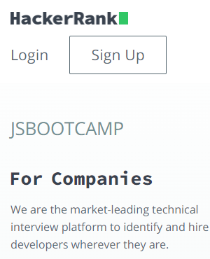

# Dom Manipulation Assignment

1. Webiste Name: [Dev To](https://dev.to/)

### Topics

    - Query Selctory, Inner HTML

    

### Sample Image

### Tasks

        Target the Top description div and change the DEV Community to <Your_Name> and description to your passion

### Output

<!-- document.querySelector(".c-link").innerHTML= "iNeuron"; -->

ans - targetd each class from side bar  
		document.querySelector(".side-bar .crayons-card .crayons-subtitle-2").innerText = "Akshay Barapatre";
		document.querySelector(".side-bar .crayons-card .color-base-70").innerText = "I write Code ";

2. Website Name: [Apple](https://support.apple.com/en-in)

### Task

### Fetch all the product name and store it in an array

### Output

['iPhone', 'Mac', 'iPad', 'Watch', 'AirPods', 'Music', 'TV']

ans - let val =document.querySelector(".as-imagegrid--7up"); // targeting the outer container and storing it in val
      val = val.querySelectorAll(".as-imagegrid-item-title");// targeting the specific tag where content is saved 
	  const array =[]; // creating empty array to store value
	  for(let i=0 ; i<val.length; i++){array.push(val[i].innerText.replace("\nSupport",""))} // pushing the val[i] value to empty array
	  array // printing the value

3. Webiste Name: [Youtube Support](https://support.google.com/youtube/)

### Topics

    - Get Element By Id, Create Element, Create Text Node, Append Child

### Sample Image

### Tasks

     Add another FAQ 'My New FAQ' to the list

### Output

 ans - var val = document.querySelector(".accordion-homepage section.parent");  storing query into val for manipulation 
		val = val.cloneNode(true); //clone the div into val
		document.querySelector(".accordion-homepage").appendChild(val); append / adding the chid into the main division and append always append into last 
		document.querySelector(".accordion-homepage").lastChild.querySelector("h3").textContent = "My New FAQ"; // changing the inner content 

4. Webiste Name: [OnePlus](https://www.oneplus.in/support)

### Topics

     Query Selector, InnerText

### Sample Image

### Tasks

      Change the contact number

### Output

<!-- answer 
document.querySelector('.one-tel-number').innerText ="+7768 940 852"; -->

 ans - document.querySelector(".one-tel-number").innerText = "+7768 940 852";

5. Webiste Name: [Samsung](https://www.samsung.com/in/offer/online/samsung-fest/)

### Topics

       getElementById, createElement, InnerText, append, setAttribute

### Sample Image

### Tasks

     Target the main div of card and change the Button text to Check out

### Output

  ans -  let array = document.querySelectorAll(".diwali-deals-product-sale-btn");
		 for(let i=0 ; i<=array.length; i++){array[i].innerText = "Check Out"};

6. Webiste Name: [Adidas](https://www.adidas.co.in/)

### Topics

    -   Query Selector, Event listeners, Changing Styles

### Sample Image

### Tasks

     Target the search box and on hover change thebackground color to red.

### Output

ans - let search = document.querySelector(".searchinput___19uW0"); // storing element in a search variable
		search.addEventListener("mouseover",changeColor); // calling specific function changeColor on mouseHover
		function changeColor(){search.style.backgroundColor = "Red"}; // changing the color of background
		search.addEventListener("mouseleave",changeColor); // calling specific function changeColor on mouseHover
		function changeColor(){search.style.backgroundColor = "#ffffff"}; // changing the color of background

7. Webiste Name: [MDN Web Docs](https://developer.mozilla.org/en-US/)

### Topics

       Form, Value, Submit

### Sample Image

### Tasks

     To Search a topic in the MDN Search bar.
     First add a text to search in the search bar and then hit the submit search button to search the docs using DOM

### Output

 ans - let val = document.querySelector("#top-nav-search-input"); // targeting the input field
		val.value = "Css Selectors" // adding value to search
		let form = document.querySelector(".header-search form") // selecting the form id
		form.submit(); // and submitting the form

8. Webiste Name: [Google](https://www.google.com/)

### Topics

       Remove Elements

### Sample Image

### Tasks

     Remove alternate languages from the home page languages listed

### Output

ans - let val = document.getElementById("SIvCob"); // targeting the div
val = val.getElementsByTagName('a'); // targeting  the a tag where all the language store 
//1 3 5 7
for (let index = 0; index < val.length; index++) {
    if (index % 2 == 0) {
     val[index].remove();
    }else{
        console.log(val[index]);
    }
}

9. Webiste Name: [Code Wars](https://www.codewars.com/)

### Topics

       Change Font Family, Color of Text.

### Sample Image

### Tasks

    Change the font family of the text to monospace and text color to the logo’s background color.

### Output

  ans - document.querySelector(".display-heading-1").style.font-family = "monopace";
		document.querySelector(".display-heading-1").style.color= "Red";

10. Webiste Name: [Freecodecamp](https://www.freecodecamp.org/)

### Topics

       querySelector, mouseover, click eventListener,  callback function, style,

### Sample Image

### Tasks

    Target the button and change background colour on mouseover

### Output

  ans - let target = document.querySelector(".login-btn-text");
		target.addEventListener("mouseover", changeColor); function changeColor() {target.style.backgroundColor = "Red"};
		target.addEventListener("mouseleave", changecolordefault) ; function changecolordefault(){
		target.style.backgroundColor = "";
		};

11. Webiste Name: [realme](https://www.realme.com/in/)

### Topics

       querySelector,style,background-image

### Sample Image

### Tasks

    change the realme logo to ineuron logo

### Output

 ans =  document.querySelector(".logo span").classList.remove('icon-logo'); // first removing the element of image
		logo = document.createElement("img"); / creating logo variable and creating new element with img tag	
		logo.src = "https://ineuron.ai/images/ineuron-logo.png";// assing src of image 	
		document.querySelector(".logo span").appendChild(logo); 	selsctiong the class and 
		logo.style.width = "100px";
		logo.style.padding = "0px 0px 0px 10px";

12. Webiste Name: [Github](https://github.com/)

### Topics

       querySelector,style,background-Color

### Sample Image

### Tasks

     change the background colour of the button to blue.

### Output

  ans = document.querySelector(".btn-primary").style.backgroundColor = "blue";

13. Webiste Name: [Hackerrank](https://www.hackerrank.com/)

### Topics

       querySelector,innerHtml

### Sample Image

### Tasks

Target the top description and change “Matching developers with great companies” to ‘JSBOOTCAMP“.

### Output

ans = document.querySelector(".fl-heading-text").innerText = "JSBOOTCAMP";
 

14. Webiste Name: [Asus](https://www.asus.com/in/)

### Topics

      querySelector,style,font-size

### Sample Image

### Tasks

       change the fontsize of “Hot Deals” to 80px

### Output

ans = document.querySelector("HotDealsAll__Heading__2fIbe").style.font-size = '80px';

15. Webiste Name: [Dell](https://www.dell.com/en-in/shop/deals/laptop-deals?gacd=10415953-9016-5761040-285981356-0&dgc=ST&gclid=Cj0KCQjwguGYBhDRARIsAHgRm4-XUDMhhVNyHXb3s1gY4ZBzORr_d9Se-buhJwy7asyUe7YdqEA11eEaAt6UEALw_wcB&gclsrc=aw.ds&nclid=BxjBlpBQsX6pjSHh-L8YYSU77EpfXRkG1AGMB5Wbeu386ykspfrPDnfx_DdFau20)

### Topics

      querySelector,style.textAlign

### Sample Image

### Tasks

       Convert the text “G15 Gaming Laptop” from left to right

### Output

  ans = first storing the value i val variable 
		var = document.querySelectorAll(".ps-title");
		then checking the product i want to chnage like 4
		val[4].style.textalign = 'right';

16. Webiste Name: [Vercel](https://vercel.com/)

### Topics

     querySelector,innerHTMl

### Sample Image

### Tasks

      change the heading “Start with the developer” to “Start with Scratch”

### Output

 question 16 -
  ans = document.querySelector(".section-title_title__VEDfK").innerText="Start with scratch";

17. Webiste Name: [Sony](https://www.sony.co.in/)

### Topics

    querySelector,innerHTMl

### Sample Image

### Tasks

     change the button text To current Date.

### Output

 
 question 17 -
 
 ans - first initialze date object let date = new Date (); // initialize date object now we can access date properties
		document.querySelector(".btn-container").innerHTML = date ; 

18. Webiste Name: [Philips](https://www.philips.co.in/)

### Topics

     querySelector,style,backgroundcolor

### Sample Image

### Tasks

    change the background colour blue to orange

### Output

ans - document.querySelector(".p-grid-no-gutter").style.backgroundColor  = "orange";

19. Webiste Name: [Canon](https://in.canon/)

### Topics

          querySelector,src

### Sample Image

### Tasks

    extract the canon logo

### Output

ans - val = document.querySelector(".logo").src;

20. Webiste Name: [Oppo](https://www.oppo.com/in/)

### Topics

          querySelector,style,color

### Sample Image

### Tasks

      Change the description colour black to orange

### Output

 ans-document.querySelector(".desc").style.color="#FFA500";